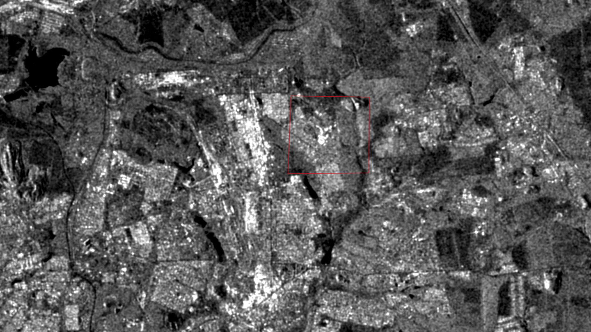

# Analisi SAR con Google Earth Engine per il monitoraggio delle zone urbane Ucraine
Davide Coviello - 62865  
Dario Satriani  - 61196

Il seguente lavoro si pone l'obiettivo di analizzare, attraverso l'utilizzo di tecnologie SAR, lo stato delle zone urbane Ucraine devastate dalla guerra.

Nella prima parte, verranno sinteticamente riportate tutte le informazioni utili per poter effettuare le analisi.

Nella seconda parte, verrà presentata l'implementazione utilizzata e verranno analizzati e discussi i risultati ottenuti.

## Indice
- [Radar ad Apertura Sintetica](#radar-ad-apertura-sintetica-sar)
  - [Frequenza e lunghezza d'onda](#frequenza-e-lunghezza-donda)
  - [Polarizzazione](#polarizzazione)
  - [Backscatter](#backscatter)
  - [Angolo di incidenza](#angolo-di-incidenza)
  - [Speckle](#speckle)
  - [Distorsioni geometriche](#distorsioni-geometriche)
  - [Sentinel-1](#sentinel-1)

- [Implementazione](#implementazione)
  - [Caricamento dati](#caricamento-dati)
  - [Filtro speckle](#filtro-speckle)
  - [Analisi immagini BN](#analisi-immagini-bn)
    - [Kharkiv](#kharkiv)
    - [Melitopol](#melitopol)
    - [Makiivka](#makiivka)
    - [Zaporizzja](#zaporizzja)
  - [Analisi immagini RGB](#analisi-immagini-rgb)
    - [Kiev](#kiev)
  - [Conclusioni](#conclusioni)

- [Sitografia](#sitografia)

## Radar ad Apertura Sintetica (SAR)
Per Radar ad Apertura Sintetica (Synthetic Aperture Radar - SAR) si intende una particolare tecnica radar che permette di ottenere immagini ad alta risoluzione da grande distanza sfruttando le microonde.

Il SAR rappresenta un esempio di sistema di imaging a microonde attivo.  
Questo, infatti, invia impulsi radar lateralmente: grazie a questo principio di osservazione laterale, il radar restituisce al sensore i segnali che colpiscono i diversi oggetti sulla Terra in momenti differenti, permettendo di distinguerli. In particolare, gli impulsi laterali del radar formano le linee dell'immagine (ovvero la dimensione in range), mentre l'altra dimensione (la dimensione in azimuth) viene formata dal movimento e dalla direzione del sensore, che invia e riceve continuamente gli impulsi <sup>[1](#sitografia)</sup>.

I principali vantaggi provenienti dall'utilizzo di un sistema SAR rispetto ad un sistema ottico per l'imaging in alta risoluzione sono i seguenti <sup>[2](#sitografia)</sup>:
- Possibilità di ottenere immagini indipendentemente dalle condizioni metereologiche;
- Possibilità di ottenere immagini sia di giorno che di notte;
- Possibilità di penetrare la vegetazione;
- Possibilità di penetrare il terreno;
- Scarsa sensibilità agli effetti atmosferici;
- Sensibilità alle proprietà dielettriche (es. acqua liquida o ghiacciata).

D'altro canto, però, i sistemi ad apertura sintetica soffrono di <sup>[2](#sitografia)</sup>:
- Effetto "speckle" (disturbo dovuto alla granulosità dell'immagine);
- Alta sensibilità alla topografia del territorio.

### Frequenza e lunghezza d'onda
La capacità dei radar SAR di poter ottenere immagini indipendentemente dalle condizioni metereologiche, sia di giorno che di notte, è dovuta all'utilizzo di diverse lunghezze d'onda che variano dal centimetro al metro - per cui generalmente più lunghe rispetto a quelle utilizzate dai sensori ottici.

Le diverse lunghezze d'onda, assieme alle relative frequenze, vengono denominate bande e sono designate attraverso l'uso di lettere (es. C, K, P, ecc...).  
In tabella vengono riportate le diverse bande assieme alla frequenza, la lunghezza d'onda e l'ambito di utilizzo tipico <sup>[3](#sitografia)</sup>.

| Banda | Lunghezza d'onda | Frequenza | Caso d'uso
| ----- | ---------------- | --------- | ----------
| Ka | 27–40 GHz | 1.1–0.8 cm | Utilizzata raramente (airport surveillance) 
| K  | 18–27 GHz | 1.7–1.1 cm | Utilizzata raramente (H2O absorption)
| Ku | 12–18 GHz | 2.4–1.7 cm | Utilizzata raramente (satellite altimetry)
| X  | 8–12 GHz  | 3.8–2.4 cm | SAR alta risoluzione (urban monitoring, ice and snow, little penetration into vegetation cover; fast coherence decay in vegetated areas)
| C  | 4–8 GHz   | 7.5–3.8 cm | SAR Workhorse (global mapping, change detection, monitoring of areas with low to moderate penetration, higher coherence, ice, ocean maritime navigation)
| S  | 2–4 GHz   | 15–7.5 cm  | Utilizzo in rapida crescita per l'osservazione della terra via SAR
| L  | 1–2 GHz   | 30–15 cm   | SAR media risoluzione (geophysical monitoring; biomass and vegetation mapping; high penetration, InSAR)
| P  | 0.3–1 GHz | 100–30 cm  | Biomasse (First p-band spaceborne SAR will be launched ~2020; vegetation mapping and assessment; Experimental SAR)

Si noti che, in generale, maggiore la lunghezza d'onda maggiore la capacità del radar di penetrare il terreno.

### Polarizzazione
La polarizzazione indica l'orientamento del piano nel quale l'onda elettromagnetica trasmessa oscilla.

Quando il piano di oscillazione è orizzontale, la polarizzazione del segnale viene indicata utilizzando la lettera **H** (Horizontal), mentre quando è verticale con la lettera **V** (Vertical).  

Un sistema SAR può lavorare con segnali polarizzati in maniera differente - anche polarizzati diversamente in fase di trasmissione e di ricezione - e, tipicamente, i segnali trasmessi sono polarizzati linearmente.  
Di conseguenza, sono possibili quattro diverse combinazioni di polarizzazioni dei segnali:

| Polarizzazione | Trasmissione | Ricezione |
| --             | ---          | ---       |
| VV | Verticale    | Verticale   |
| HH | Orizzontale  | Orizzontale |
| VH | Verticale    | Orizzontale |
| HV | Orizzontale  | Verticale   |

### Backscatter
Per backscatter si intende la porzione di segnale ricevuta all'antenna del radar.

L'intensità del backscatter viene utilizzata per determinare la relativa intensità del pixel nell'immagine generata: un'area scura - indice di basso backscatter - indica che un basso quantitativo di energia è arrivato all'antenna, mentre un'area chiara - indice di alto backscatter - indica che è stato ricevuto un alto quantitativo di energia.

Sebbene siano diversi i fattori che possono influenzare il backscatter per una determinata zona - si pensi, a titolo di esempio, all'umidità del terreno - in linea generale vale che questo è tanto maggiore quanto maggiore è la ruvidezza della superficie: a superfici completamente piatte corrisponderà un pixel completamente nero, mentre a superfici più ruvide corrisponderà un pixel sostanzialmente grigio - parte del segnale si disperde ed altra torna al sensore. Quando, però, il segnale rimbalza su due superfici prima di essere ricevuto dall'antenna del radar (*double-bounce*) il pixel risulterà molto luminoso<sup>[4](#sitografia)</sup>.

Anche la tipologia di polarizzazione può influenzare il backscatter. In particolare<sup>[3](#sitografia)</sup>: 
- La polarizzazione VV è più sensibile alle superfici ruvide (rough surface scattering);
- Le polarizzazioni VH e HV sono più sensibili ai casi di scattering volumetrico;
- La polarizzazione HH è più sensibile al double-bounce;

### Angolo di incidenza
Si definisce angolo di incidenza l'angolo formatosi tra l'onda incidente del radar e la normale della superficie su cui questo incide.  
In particolare, è possibile definire l'angolo locale di incidenza (θ) tenendo in considerazione l'inclinazione locale della superficie.

Bisogna notare che il backscatter è minore quando l'immagine è acquisita a bassi angoli di incidenza rispetto a quando, la stessa, è acquisita ad angoli di incidenza maggiori: di conseguenza, la stessa area ha intensità di backscatter differenti - e non comparabili - quando analizzata con angoli di incidenza diversi<sup>[5](#sitografia)</sup>.

### Speckle
Per speckle si intende un rumore granulare presente nell'immagine SAR che ne degrada la qualità.

Essendo questo un disturbo esistente in tutte le rilevazioni, sono state messe a punto diverse tecniche che permettono di filitrare il rumore<sup>[2](#sitografia)</sup>.

**Multi-look processing**  
Il raggio emesso dal radar viene suddiviso in una serie di sotto-raggi (1-5). Sebbene le singole rilevazioni dei sotto-raggi siano soggetti al rumore, sommando e considerando la media di tutti i contributi è possibile ottenere un'immagine con speckle ridotto.

**Spatial Filtering**  
Consiste nell'applicare un filtro che sostituisce ad ogni pixel dell'immagine un valore calcolato considerando una finestra 5x5 centrata sul pixel corrente.

### Distorsioni geometriche
Per via del particolare sistema di acquisizione delle immagini side-looking - differente rispetto ai sistemi ottici tradizionali - è necessario considerare (e, di conseguenza, correggere) alcune tipologie di distorsioni geometriche.

In particolare, considerando una regione montuosa, alcune tipologie di distorsioni geometriche sono<sup>[2](#sitografia)</sup>:
- Scorcio prospettico o *foreshortening*; 
- Sovrapposizione o *layover*;
- Ombreggiatura o *shadowing*.

### Sentinel-1
La missione Sentinel-1 comprende una costellazione di due satelliti con orbita polare, operanti in banda C<sup>[6](#sitografia)</sup>.  
Ciascun satellite ha una copertura globale ogni 12 giorni, per cui è possibile ottenere una copertura totale del globo ogni 6 giorni utilizzando i dati di entrambi i satelliti.

## Implementazione
Per condurre un'analisi dei dati SAR nelle zone urbane Ucraine distrutte dall'invasione Russa, è stato implementato uno script su [Google Earth Engine](https://code.earthengine.google.com/).  
Sono stati adottate due metodologie diverse: una basata sul confronto di due immagini ad un solo livello ed una basata sulla costruzione di un'immagine rgb in cui ogni canale corrisponde ad un determinato periodo.

### Caricamento dati
Tramite la funzione `Line drawing` di Google Earth Engine è stato disegnato un poligono sulla mappa corrispondente alla regione di interesse (**ROI**) per cui scaricare ed analizzare i dati del radar. 

In particolare sono state selezionate:

- l'Ucraina Orientale;
- i dintorni della capitale Kiev.


Una volta scelta la ROI è stato possibile caricare i dati provenienti dal Sentinel-1 con la funzione `ee.ImageCollection('COPERNICUS/S1_GRD')`: questa restituisce i dati SAR in banda C in scala logaritmica.

Dal momento che i dati del Sentinel-1 vengono raccolti con configurazioni, risoluzioni, combinazioni di bande o orbite differenti è necessario filtrarli per ottenerne un sottoinsieme omogeneo.

Il processo di filtraggio descritto sopra è ottenibile applicando la funzione `filter` alla collezione restituita in output da `ee.ImageCollection('COPERNICUS/S1_GRD')` e specificando il particolare metadato da considerare. 

Per questa analisi, i dati sono stati filtrati secondo le seguenti condizioni:

- *instrumentMode: IW (Interferometric Wide Swath)*<sup>[7](#sitografia)</sup>, ovvero scegliendo la modalità di utilizzo più generica che acquisisce dati per fasce di 250 km, con una risoluzione spaziale di 5m x 20m;

- *orbitProperties_pass: ASCENDING*, ovvero scegliendo l'orbita ascendente;

- *resolution_meters: 10*

- Polarizzazioni: *VV e VH*

```javascript
var collection = ee.ImageCollection('COPERNICUS/S1_GRD')
    .filter(ee.Filter.eq('instrumentMode', 'IW'))
    .filter(ee.Filter.eq('orbitProperties_pass', 'ASCENDING'))
    .filterMetadata('resolution_meters', 'equals', 10)
    .filterBounds(roi)
    .select('VV', 'VH');
```

La collezione principale è stata ulteriormente suddivisa in base a determinati periodi temporali:

```javascript
var before = collection.filterDate('2021-12-31', '2022-01-31').mosaic();
var during = collection.filterDate('2022-03-01', '2022-03-31').mosaic();
var after = collection.filterDate('2022-04-01', '2022-04-30').mosaic();
```

La prima delle tre sottocollezioni, `before`, si riferisce ad un periodo in cui la regione si trovava in condizioni normali.  
La seconda sottocollezione, `during`, contiene i dati del periodo iniziale dell'invasione Russa.  
La terze sottocollezione, `after`, infine, è quella relativa al periodo più recente in cui un numero considerevole di zone urbane sono state distrutte.

### Filtro speckle
Sebbene le immagini SAR abbiano la caratteristica di non subire alterazioni dovute alle condizioni meteo, hanno lo svantaggio di essere rumorose, fenomeno noto come [speckle](#speckle).

Lo speckle peggiora significativamente la qualità dell'immagine, dunque ridurlo è necessario.

Per ottenere un risultato accettabile, è stata utilizzata la funzione `focal_mean` con raggio 50:

```javascript
var SMOOTHING_RADIUS = 50;
var before_filtered = before.focal_mean(SMOOTHING_RADIUS, 'circle', 'meters');
var during_filtered = during.focal_mean(SMOOTHING_RADIUS, 'circle', 'meters');
var after_filtered = after.focal_mean(SMOOTHING_RADIUS, 'circle', 'meters');
```

### Analisi immagini BN
Per effettuare delle analisi visuali, è stato  aggiunto alla mappa un livello per ogni collezione di cui sopra con il seguente comando:

```javascript 
Map.addLayer(before_filtered, {min:-15, max:0}, 'Before invasion filtered', 0);
Map.addLayer(during_filtered, {min:-15, max:0}, 'During invasion filtered', 0);
Map.addLayer(after_filtered, {min:-15, max:0}, 'After invasion filtered', 0);
```

L'obiettivo di questa ricerca è stato quello di rilevare zone in cui l'intensità dei pixel diminuisce dall'immagine precedente all'invasione (derivata dalla collezione `before_filtered`) all' immagine successiva all'invasione (collezione `after_filtered`), per effetto della riduzione del double bounce. Questo evento si giustifica, infatti, con la  riduzione dell'area urbana.

Di seguito vengono riportati degli esempi significativi di zone particolarmente colpite da attacchi militari.

#### Kharkiv
Polarizzazione utilizzata: **VV**

La zona nord-occidentale della città è quella in cui si riscontra riduzione di intensità nei pixel.


#### Melitopol
Polarizzazione utilizzata: **VV**


#### Makiivka
Polarizzazione utilizzata: **VV**

A nord-est della città di Makiivka (NE di Donetsk), sembra che sparisca completamente una zona urbana.




#### Zaporizzja
Polarizzazione utilizzata: **VH**

Anche in questo caso si riportano zone, come quella a sud-est della città, in cui l'area urbana sembra più frastagliata.


### Analisi immagini RGB

Un'altra tecnica utilizzata per rilevare il cambiamento nelle zone urbane colpite dagli interventi militari ai danni delle città Ucraine, è stata quella di sovrapporre tre livelli derivati dalle tre collezioni di cui sopra,  assegnando a ciascuno di essi uno dei tre colori RGB, al fine di formare un'immagine a colori.

Alla collezione `before_filtered` è stato assegnato il colore rosso, alla collezione `during_filtered` il colore verde e a `after_filtered` il rosso.  
 Di tutte e tre le collezioni si è utilizzata la polarizzazione VV.

```javascript 
var VV1 = ee.Image(before_filtered);
var VV2 = ee.Image(during_filtered);
var VV3 = ee.Image(after_filtered);

Map.addLayer(VV1.addBands(VV2).addBands(VV3), {min: -12, max: -7}, 'RGB composite');
```

Utilizzando questa tecnica si ottiene un'immagine a colori, in cui le zone bianche rappresentano quelle in cui sono stati rilevati cambiamenti insignificanti, dal momento che nessuno tra i tre colori prevale.

L'obiettivo di questa ricerca è stato evidenziare zone a prevalenza di rosso, ovvero quelle zone in cui l'intensità dei pixel era maggiore prima dell'invasione ed in cui dopo l'invasione è diminuita sensibilmente.

#### Kiev


### Confronto Tecniche

Per eseguire un confronto delle tecniche illustrate fino a questo punto, è stato scelto come target dell'analisi un obiettivo dichiarato dal governo Russo: la stazione di Kiev.

#### Polarizzazione VV


#### Composizione RGB con Polarizzazione VV


#### Composizione RGB con Polarizzazione VH


### Classificatore Supervisionato

Per generalizzare il più possibile quanto osservato, sono state utilizzate le evidenze degli step precedenti per addestrare un classificatore supervisionato.

Tramite lo strumento di selezione sulla mappa, sono stati etichettate:
- 101 immagini di zone distrutte, contraddistinte da poligoni rossi;
- 54 immagini di terreno coltivato, contraddistinte da poligoni verdi;
- 57 immagini di zona urbana, contraddistinte da poligoni bianchi;
- 26 immagini di corsi d'acqua.

Tutte le collezioni di immagini sono state salvate in memoria sotto forma di `FeatureCollection`, specificando per ognuna la proprietà `Type` valorizzata con un numero crescente (da 0 a 3), per differenziare ciascuna collezione, ed unite in un'unica collezione.
Quest'ultima collezione costituisce il dato di training del classificatore.

È stato scelto un classificatore basato su alberi di decisione, una delle tecniche più efficaci per il learning supervisionato.
Il classificatore è fornito tramite le API di Google Earth Engine ed è stato configurato come descritto nel seguente codice:

```javascript
var classifier = ee.Classifier.smileCart().train({
  features: training,
  classProperty: 'type',
  inputProperties: bands
});
```

Infine, il risultato della classificazione è stato aggiunto come nuovo layer alla mappa.
Di seguito se ne riportano i risultati visuali.

- I pixel rossi indicano le zone distrutte;
- i pixel verdi indicano il terreno coltivato;
- i pixel bianchi indicano la zona urbana;
- i pixel azzurri indicano corsi d'acqua.


## Conclusioni

L'utilizzo delle tecniche di confronto di immagini SAR precedenti e successive ad un evento di distruzione urbana e di composizione RGB per rilevare cambiamenti nella morfologia delle città e delle zone abitate, si è rivelata ben funzionante.
La sua applicazione generalizzata, mediante l'uso di un classificatore supervisionato ne ha esteso le possibilità e, pur scontrandosi con i limiti di memoria utilizzabili da Google Earth Engine, ha reso possibile l'analisi di zone molto estese.

## Sitografia
*[1]. [ESA Eduspace IT - Radar ad Apertura Sintetica](https://www.esa.int/SPECIALS/Eduspace_Global_IT/SEMLT0G64RH_0.html)*  
*[2]. [Erica Podest - SAR Tutorial](https://science.nasa.gov/science-red/s3fs-public/atoms/files/SNWG%20SAR_Podest%202020_03_17-sml.pdf)*  
*[3]. [Earthdata - What is SAR](https://earthdata.nasa.gov/learn/backgrounders/what-is-sar)*  
*[4]. [ESA - ASAR Product Handbook](https://earth.esa.int/eogateway/documents/20142/37627/ASAR-Product-Handbook.pdf)*  
*[5]. [Gregoriy Kaplan, Lior Fine, Victor Lukyanov, V. S. Manivasagam, Josef Tanny and Offer Rozenstein - Normalizing the Local Incidence Angle in Sentinel-1 Imagery to Improve Leaf Area Index, Vegetation Height, and Crop Coefficient Estimations](https://www.mdpi.com/2073-445X/10/7/680/pdf)*  
*[6]. [Copernicus - Sentinel-1 ](https://sentinels.copernicus.eu/web/sentinel/missions/sentinel-1)*  
*[7]. [Copernicus - Sentinel-1 IWS](https://sentinels.copernicus.eu/web/sentinel/user-guides/sentinel-1-sar/acquisition-modes/interferometric-wide-swath)*  
*[8]. [GEE Docs - Image Collection ](https://developers.google.com/earth-engine/guides/ic_creating)*
